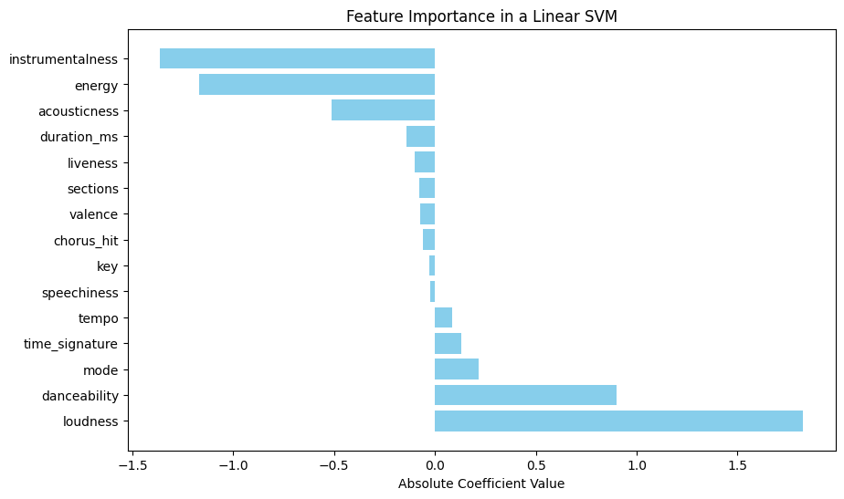
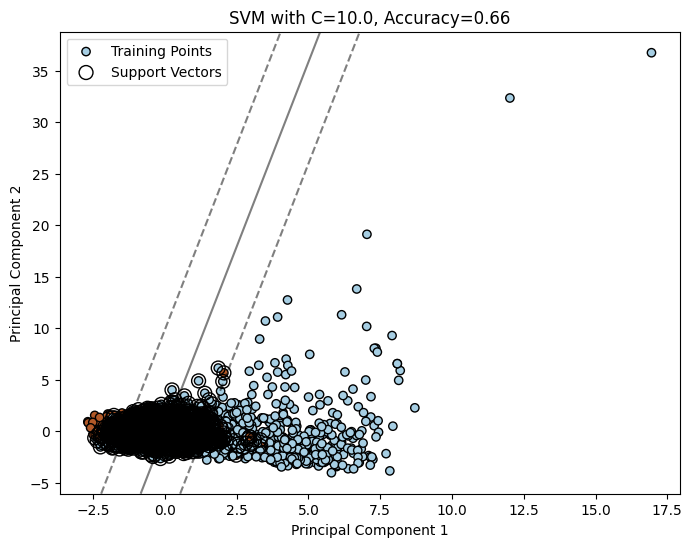

---
output:
  pdf_document: default
  html_document: default
---
# Abstract:

In the evolving music industry, predicting song success is crucial. This research explores machine learning models—logistic regression, decision trees, support vector machines (SVM), random forests, and gradient boosting—to uncover their effectiveness in discerning hit songs. The study aims to provide insights for informed decision-making in the music domain.

# Introduction:

As the music industry adapts, machine learning emerges as a tool for forecasting song success. This study assesses logistic regression, decision trees, SVM, random forests, and gradient boosting to unravel their strengths in identifying hit songs.

# Objective:

Evaluate and compare machine learning models in predicting song success, offering a nuanced understanding of their effectiveness.

# Methodology:

The research employs logistic regression for baseline modeling, decision trees for interpretability, SVM for nuanced classification, random forests for ensemble learning, and gradient boosting for enhanced predictive power.

# Structure:

The paper proceeds with an overview of the dataset, exploratory data analysis, and detailed analyses of logistic regression, decision trees, SVM, random forests, and gradient boosting. A comparative analysis follows, concluding with key findings and implications. This research contributes insights at the intersection of music and machine learning, shaping the landscape of predictive modeling in song success.

---

# SVM Modeling Introduction:

In the initial phase of our SVM modeling for music classification using the Spotify dataset, our focus was on understanding the role of different kernels and the regularization parameter (C) in the SVM model.

## Kernel Selection:

SVM allows for various kernels, including linear, Radial Basis Function (RBF), Sigmoid, and Polynomial. The choice of kernel determines how the model captures complex patterns within the data. In this context, we explored the impact of different kernels to identify the one that best suits our music classification task.

## Regularization Parameter (C):

The regularization parameter (C) in the SVM model is crucial for controlling the balance between fitting the training data well and generalizing to new, unseen data. A large C value results in a smaller margin of the hyperplane, which can lead to overfitting, while a small C value allows for a larger margin, risking underfitting.

## Significance to Problem Statement:

Understanding the role of kernel selection and regularization in SVM modeling is essential for addressing the challenges posed by diverse music features. This knowledge will guide us in refining the SVM model to achieve optimal classification performance and provide insights into the significant features influencing music success.

---

# Linear Kernel:

In the second phase of our SVM modeling, we focused on employing a linear kernel to build the initial SVM model. This step aimed to assess the model's performance using this simpler form of the kernel.

## Model Performance Metrics:

The linear kernel SVM model was trained and evaluated on the Spotify dataset, comprising various audio features. Key performance metrics were computed to gauge the model's effectiveness in predicting music success.

- **Train Accuracy:** The model exhibited a Train Accuracy of 0.82, indicating its proficiency in learning from the training set.
- **Test Accuracy:** The Test Accuracy maintained a high value of 0.82, suggesting robust generalization to unseen music tracks.
- **Precision:** Precision, representing the accuracy of positive predictions, stood at 0.83.
- **Recall:** The Recall metric, measuring sensitivity to positive instances, reached 0.82.
- **F1 Score:** The balanced F1 Score of 0.82 emphasized the harmonious trade-off between precision and recall.

## Challenges Identified:

Despite the impressive accuracy metrics, a closer examination revealed a limitation in recall (0.82), indicating challenges in identifying positive instances. This observation prompted further investigation and steps to address the recall limitation.

## Observations:

The evaluation of the linear kernel model provides valuable insights into its initial performance on music classification. Recognizing the recall limitation is crucial for refining the model and achieving a more balanced prediction of music success, aligning with our overarching goal of developing an effective classification model for the Spotify dataset.

---

# RBF Kernel:

Building on the insights gained from the linear kernel model, we progressed to implement the Radial Basis Function (RBF) kernel in our SVM model. The transition aimed to enhance the model's complexity and capture more intricate patterns within the Spotify dataset.

## Model Performance Metrics:

The SVM model with the RBF kernel underwent rigorous evaluation, and key performance metrics were assessed to gauge its effectiveness in predicting music success.

- **Train Accuracy:** The RBF kernel SVM model showcased an improved Train Accuracy of 0.86, highlighting its proficiency in learning from the training set.
- **Test Accuracy:** The Test Accuracy maintained a high value of 0.85, indicating robust generalization to unseen music tracks.
- **Precision:** Precision, representing the accuracy of positive predictions, reached a commendable value of 0.85.
- **Recall:** The Recall metric, measuring sensitivity to positive instances, achieved a noteworthy value of 0.85.
- **F1 Score:** The balanced F1 Score of 0.85 emphasized the harmonious trade-off between precision and recall.

## Possible Reasons for Improvement:

The adoption of the RBF kernel proved effective in capturing complex patterns within the dataset, contributing to the notable enhancements observed in various performance metrics.

## Observations:

The refined model with the RBF kernel signifies a strategic step towards achieving higher accuracy and capturing intricate relationships within the Spotify dataset. This aligns with our overarching goal of developing an effective classification model to discern music success factors.

---

# Hyperparameter Tuning using Grid Search CV:

Recognizing the pivotal role of hyperparameters in SVM models, we employed the GridSearchCV technique to meticulously fine-tune the model. This process aimed to identify the optimal combination of hyperparameters for our RBF kernel SVM model.

## GridSearchCV Process:

A systematic exploration of hyperparameter space was conducted, considering various combinations to ascertain the most favorable settings for our SVM model.

**Numerical Insights:**
- **Optimal Parameters:**
  - Regularization Parameter (C): 1
  - Kernel: RBF
  - Gamma: 0.1
- **Accuracy:** The optimized model achieved an accuracy of 0.85, signifying a well-balanced classification capability.
- **Precision:** Precision, denoting accurate positive predictions, reached 0.81, maintaining a favorable balance.
- **Recall:** The Recall metric exhibited a noteworthy value of 0.90, showcasing the model's heightened sensitivity to positive cases.

## Possible Reasons for Improvement:

The meticulous tuning of hyperparameters addressed model intricacies, leading to an optimal balance between precision and recall. The selected parameters reflect a strategic configuration for improved model performance.

## Observations:

The hyperparameter optimization step adds a layer of sophistication to our SVM model, ensuring it operates at peak efficiency. By identifying the optimal settings, we enhance the model's ability to discern intricate patterns within the Spotify dataset, contributing to our broader objective of accurate music success prediction.

---

# Feature Importance:

Moving beyond hyperparameter optimization, we delved into understanding feature importance to streamline our SVM model. By identifying and focusing on the most significant predictors, we aimed to create a more interpretable and efficient model.

## Feature Importance Analysis:

Showing the top 3 positive and negative correlated features and their impact on the Outcome.

| Feature    | Correlation | Explanation |
| ------- | --- | ----- |
| Instrumentalness   | Negative  | Music with higher instrumentalness is more likely to be flop.    |
| Energy     | Negative  | Music with higher energy is more likely to be a flop.    |
| Acousticness | Negative  | Music with higher acousticness is more likely to be flop.    |
| Loudness | Positive | Music with higher loudness is more likely to be a hit song. |
| Danceability | Positive | Music with more danceability is more likely to be a hit song. |
| Mode | Positive | Music with a specific mode is more likely to be a hit song. |

- **Identifying Crucial Predictors:** Leveraging the coefficients of the best-performing SVM model, we conducted a feature importance analysis.
- **Top Predictors:** Loudness, instrumentalness, energy, danceability, and acousticness emerged as highly significant predictors.

**Numerical Insights:**
- **Simplified Model Performance:** Developing a simplified model using only the top 5 features maintained commendable accuracy metrics.
  - **Accuracy:** Slight decrease from 0.85 to 0.82, reflecting a trade-off for a more interpretable and efficient model.
  - **Precision:** Minimal decrease from 0.85 to 0.82 indicates robust positive predictions.
  - **Recall:** Maintenance of high recall (0.81) suggests effective identification of positive cases.
  - **F1 Score:** The harmonic mean reflects the balanced nature of precision and recall.

## Observations:

The emphasis on significant features aimed at creating a more interpretable model without compromising predictive power. By focusing on the top predictors, we refined the model's complexity while retaining its ability to make accurate predictions. This step aligns with the broader goal of developing a predictive model for music success, providing valuable insights to stakeholders in the music industry.

---

# SVM Margin Visualization

## Introduction:

In this phase, we aimed to comprehend the impact of different margin complexities on classification boundaries. Due to the challenge of visualizing an n-dimensional SVM hyperplane, we employed Principal Component Analysis (PCA) to reduce the dataset to two dimensions. This allowed us to visualize the SVM margin in the context of a two-dimensional plane and gain insights into the model's behavior.

## Margin Visualization:

- **Default Margin:** Visualized the default SVM margin, illustrating the initial decision boundary.
- **Weak Margin:** Explored a scenario with a weaker margin, representing a more permissive model.
- **Strong Margin:** Examined the impact of a stronger margin, reflecting a more restrictive model.

**Observations:**
- All three margins, default, weak, and strong, exhibit similar accuracies in the reduced two-dimensional space. This unexpected consistency raises questions about the impact of margin complexity on model performance.

**Possible Reasons for Similar Accuracies:**

- Data Distribution: The nature of the dataset, even in a reduced space, might not distinctly favor a stronger or weaker margin, resulting in comparable accuracies.

Here is the SVM Margin for one of the scenario:

## Conclusion:

Understanding the nuances of SVM margin visualization provides insights into the model's behavior under different scenarios. This comprehension is vital for selecting an optimal margin complexity that aligns with real-world use cases.

By visualizing SVM margins, we gain a deeper understanding of how our model adapts to varying complexities. This understanding is essential for making informed decisions about model selection and deployment, ensuring the model's robust performance in music classification applications.

---

# Conclusions From SVMs:

This detailed analysis of SVM variants, hyperparameter optimization, feature importance, and model complexity visualization provides a comprehensive understanding of the Spotify dataset's classification task. The findings contribute insights into the nuanced dynamics of SVM performance, facilitating informed decision-making in music classification applications.
